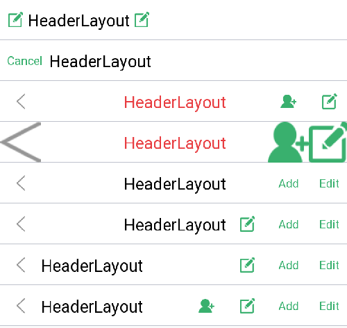

# HeaderLayout
欢迎大家使用。 
此自定义控件为头部标题栏控件  

<B>集成方法：</B>

    allprojects {
        repositories {
            maven { url "https://raw.githubusercontent.com/extfff/repos/master" }
        }
    }

    dependencies {
        compile 'com.vendor.widget:headerlayout:1.1'
    }

<B>主要提供内容：</B>

左边按钮：
默认支持icon和文字两种方式（只能选一个，左边按钮默认只有一个）

标题文字：
支持居左和居中显示(1.1支持drawStart等操作)

右边按钮：
最多支持四个显示（2个文字、2个按钮 ）

自定义效果：
控件基于RelativeLayout，所以可以自由添加需要的内容


<B>调用步骤：</B>  
**1、可配置的所有内容**

    <item name="hl_iv_status_padding" type="id"/>
    <item name="hl_view_navigation" type="id"/>

    <color name="default_header_layout_title_textColor">#fff</color>
    <dimen name="default_header_layout_title_textSize">20sp</dimen>
    <dimen name="default_header_layout_menu_textSize">15sp</dimen>

    <declare-styleable name="HeaderLayout">
        <attr name="hlSupportTranslucentStatus" format="boolean"/>
        <attr name="hlTitleText" format="string"/>
        <attr name="hlTitleTextColor" format="color"/>
        <attr name="hlTitleTextSize" format="dimension"/>
        <attr name="hlTitleTextDrawableTop" format="reference"/>
        <attr name="hlTitleTextDrawableStart" format="reference"/>
        <attr name="hlTitleTextDrawableEnd" format="reference"/>
        <attr name="hlTitleTextDrawableBottom" format="reference"/>
        <attr name="hlTitleTextDrawablePadding" format="dimension"/>
        <attr name="hlItemTextColor" format="color"/>  <!-- 所有按钮文字按钮颜色 -->
        <attr name="hlItemTextSize" format="dimension"/>  <!-- 所有按钮文字按钮大小-->
        <attr name="hlItemTextPaddingStartAndEnd" format="dimension"/>  <!-- 所有文字按钮左右间距 -->
        <attr name="hlNavigationIcon" format="reference"/>   <!-- 返回按钮 or 左边按钮 图片 二选一 -->
        <attr name="hlNavigationText" format="reference"/>   <!-- 返回按钮 or 左边按钮 文字 二选一 -->
        <attr name="hlNavigationWidth" format="dimension" />
        <attr name="hlNavigationMinWidth" format="dimension" />
        <attr name="hlNavigationMaxWidth" format="dimension" />
        <attr name="hlNavigationHeight" format="dimension" />
        <attr name="hlNavigationMinHeight" format="dimension" />
        <attr name="hlNavigationMaxHeight" format="dimension" />
        <attr name="hlNavigationScaleType" format="enum">
            <enum name="matriX" value="0"/>
            <enum name="fitXY" value="1"/>
            <enum name="fitStart" value="2"/>
            <enum name="fitCenter" value="3"/>
            <enum name="fitEnd" value="4"/>
            <enum name="center" value="5"/>
            <enum name="centerCrop" value="6"/>
            <enum name="centerInside" value="7"/>
        </attr>
        <attr name="hlMenuIcon" format="reference"/>  <!-- 右边按钮 -->
        <attr name="hlMenuIconId" format="reference"/>  <!-- 右边按钮id -->
        <attr name="hlMenu2Icon" format="reference"/>  <!-- 右边按钮 -->
        <attr name="hlMenu2IconId" format="reference"/>  <!-- 右边按钮id -->
        <attr name="hlMenuText" format="string"/>  <!-- 右边文字按钮 -->
        <attr name="hlMenuTextId" format="string"/>  <!-- 右边文字按钮id -->
        <attr name="hlMenu2Text" format="string"/>  <!-- 右边文字按钮 -->
        <attr name="hlMenu2TextId" format="string"/>  <!-- 右边文字按钮id -->
        <attr name="hlMenuAlign" format="enum">  <!-- 右边按钮排序 -->
            <enum name="alignText" value="0"/>  <!-- 文字在最右边 -->
            <enum name="alignIcon" value="1"/>  <!-- 图标在最右边 -->
            <enum name="alternate" value="2"/>  <!-- 图标 文字 图标 文字 -->
            <enum name="alternate2" value="3"/>  <!--  文字 图标 文字 图标 -->
        </attr>
        <attr name="hlSpitLineColor" format="reference"/>   <!-- 底部分割线 -->
        <attr name="hlSpitLineHeight" format="dimension"/>   <!-- 底部分割线 -->
        <attr name="hlTitleAlignLeft" format="boolean"/>  <!-- 居左显示 -->
    </declare-styleable>

**2、布局引用**

    <com.vendor.lib.widget.HeaderLayout
        android:layout_width="match_parent"
        android:layout_height="45dp"
        android:background="@drawable/title_bg"
        app:hlItemTextColor="@color/green"
        app:hlItemTextSize="13sp"
        app:hlNavigationMinWidth="45dp"
        app:hlTitleAlignLeft="true"
        app:hlNavigationScaleType="centerInside"
        app:hlNavigationIcon="@drawable/ic_back"
        app:hlSupportTranslucentStatus="false"
        app:hlTitleText="@string/app_name"
        app:hlTitleTextColor="@color/black"
        app:hlTitleTextSize="18sp"
        app:hlMenuIcon="@drawable/iv_edit"
        app:hlMenuIconId="@+id/btn_edit"
        app:hlMenuText="@string/edit"
        app:hlMenuTextId="@+id/btn_edit"
        app:hlMenu2Icon="@drawable/iv_add"
        app:hlMenu2IconId="@+id/iv_add"
        app:hlMenu2Text="@string/add"
        app:hlMenu2TextId="@+id/btn_add" />

有问题联系：QQ群 254202293